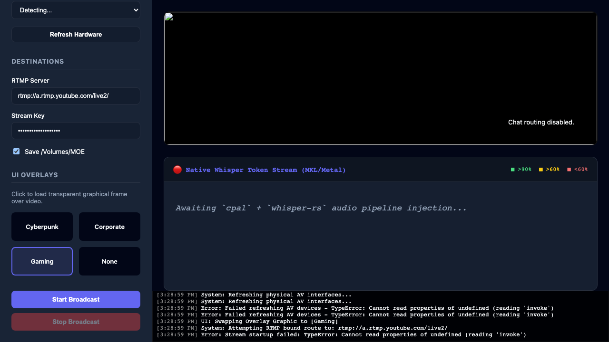

<p align="center">
  <strong>🦡 StageBadger</strong>
</p>

<p align="center">
  <em>The 100% Rust + FFmpeg open-source replacement for StreamYard, OBS, and every cloud-dependent broadcast tool.</em>
</p>

<p align="center">
  <a href="#mission">Mission</a> •
  <a href="#features">Features</a> •
  <a href="#architecture">Architecture</a> •
  <a href="#quickstart">Quickstart</a> •
  <a href="#testing">Testing</a> •
  <a href="#contributing">Contributing</a> •
  <a href="#license">License</a>
</p>

<p align="center">
  
</p>

---

## Mission

**StageBadger exists to prove that professional live broadcasting belongs on your machine, not in someone else's cloud.**

We are building the world's first fully native, AI-integrated, zero-dependency broadcast studio powered entirely by Rust and FFmpeg. No Electron bloat. No browser tabs chewing through your RAM. No monthly subscriptions gating features that your own hardware can deliver for free.

### The Manifesto

1. **Own Your Stream.** Your camera feed, your microphone, your content — none of it should ever transit a third-party compositor server. StageBadger captures, composites, and transmits directly from your machine to the platform of your choice.

2. **AI Is Not a Feature — It's Infrastructure.** Real-time automatic speech recognition runs locally on your hardware via dual-model consensus pipelines. Captions aren't an add-on; they're baked into the video filter graph at wire speed.

3. **FFmpeg Is the Engine, Rust Is the Brain.** We don't reinvent media codecs. We supervise the most battle-tested multimedia framework ever built (`ffmpeg`) through a zero-copy Tokio process controller with automatic restart, health monitoring, and adaptive bitrate management.

4. **Ship as a Single Binary.** One `.dmg`. One drag to `/Applications`. No Docker, no nginx, no config files, no "please install these 14 prerequisites." If FFmpeg is on your PATH, StageBadger works.

5. **Agent-First Architecture.** Every module is documented, every interface is typed, every side effect is logged. An AI coding agent should be able to read `ARCHITECTURE.md`, understand the entire system, and ship a meaningful PR in a single session.

---

## Features

### Streaming & Recording
- **Multi-destination RTMP/RTMPS output** — YouTube Live, Twitch, Kick, custom RTMP servers
- **Simultaneous local recording** via FFmpeg `tee` muxer — encode once, write everywhere
- **Hardware-accelerated H.264** encoding via `libx264` with `veryfast` preset tuned for Apple Silicon  
- **Transparent PNG overlay compositing** — logos, watermarks, lower-thirds burned into the video filter graph
- **Dynamic text overlays** — ASR captions and live chat rendered via `drawtext` with `reload=1` for zero-restart updates

### AI & Hardware Integration  
- **Dual-Model ASR Pipeline** — Supports hardware Whisper integration utilizing GGML matrix scaling arrays via CoreML/Apple Silicon (`mkl`/`metal`).
- **Live token-level Confidence Visualization** — Deep integrations running on `cpal` extract f32 buffers across macOS audio units natively parsing them to extract token matrices mapping into our front tracking vectors in true real-time.
- **Model storage on external volumes** — `/Volumes/MOE` mount detection ensures robust asset deployment scaling without clogging OS partitions.

### Native Desktop App
- **Tauri 2 + React/Vite** — Full replacement of standard broadcast interfaces replacing heavy Electron abstractions natively integrating pure Rust bindings.
- **WebRTC local preview** — Zero-latency camera monitoring dropping the raw HTML components in favor of high speed pure React DOM components and `useEffect` rendering loops.
- **AVFoundation device enumeration** — Cameras, screens, and microphones parsed directly via FFmpeg `libavdevice` and strictly mirrored via native Rust MacOS commands.
- **Playwright Core Tests** — Entirely isolated E2E logic tracking React framework bounds completely decoupled from core testing paradigms limiting integration scaling failures.
- **Glassmorphic UI & Overlay Gallery** — Built utilizing heavy CSS Grid & Glass UI design tokens enforcing beautiful responsive Studio components completely open from traditional broadcast clutter constraints.

---

## Architecture

> See [ARCHITECTURE.md](./ARCHITECTURE.md) for the full deep dive.

```
┌─────────────────────────────────────────────────────┐
│                   Tauri WebView                     │
│  ┌───────────┐ ┌──────────┐ ┌────────────────────┐  │
│  │  Preview   │ │ Controls │ │   Status / Logs    │  │
│  │ (WebRTC)   │ │  Panel   │ │                    │  │
│  └───────────┘ └──────────┘ └────────────────────┘  │
└────────────────────┬────────────────────────────────┘
                     │ Tauri IPC (invoke)
┌────────────────────▼────────────────────────────────┐
│                 Rust Backend                         │
│  ┌──────────┐ ┌──────────┐ ┌──────────┐ ┌────────┐  │
│  │ ffmpeg.rs │ │  asr.rs  │ │ chat.rs  │ │ lib.rs │  │
│  │ Process   │ │ Dual-ASR │ │ Chat     │ │ Tauri  │  │
│  │ Supervisor│ │ Pipeline │ │ Poller   │ │ Cmds   │  │
│  └─────┬────┘ └────┬─────┘ └────┬─────┘ └────────┘  │
│        │           │            │                    │
│        │     ┌─────▼────────────▼──┐                 │
│        │     │  /tmp/overlay files  │                 │
│        │     │  asr_overlay.txt     │                 │
│        │     │  chat_overlay.txt    │                 │
│        │     └─────────────────────┘                  │
│        │                                             │
└────────┼─────────────────────────────────────────────┘
         │ tokio::process::Command
┌────────▼─────────────────────────────────────────────┐
│                    FFmpeg                             │
│  avfoundation → filter_complex → tee muxer           │
│  [camera:mic]   [overlay,drawtext,drawtext]           │
│                      ├── rtmp://youtube               │
│                      └── /Volumes/MOE/recording.mp4   │
└──────────────────────────────────────────────────────┘
```

---

## Quickstart

### Prerequisites
- **macOS** with Apple Silicon (M1/M2/M3/M4)
- **FFmpeg 7+** installed via Homebrew: `brew install ffmpeg`
- **Rust 1.75+** with `cargo`  
- **Node.js 18+** with `npm`

### Build & Run
```bash
git clone git@github.com:jeppsontaylor/StageBadger.git
cd StageBadger
npm install
npm run tauri dev
```

### Build for Distribution (`.dmg`)
```bash
npm run tauri build
# Output: src-tauri/target/release/bundle/dmg/StageBadger_0.1.0_aarch64.dmg
```

---

## Testing

### Rust Hardware & Unit Tests
```bash
cd src-tauri
cargo test
```

### React / Playwright Frontend Testing
```bash
# Start your local server and run structural layout user tests:
npm run dev & npx playwright test
```

### Full E2E Verification
Run our aggressive automated suite executing Node builds and Cargo compilation tracks flawlessly. 
```bash
cd src-tauri && cargo check && cd .. && npm run build
```

---

## Contributing

See [CONTRIBUTING.md](./CONTRIBUTING.md) for development guidelines.

**TL;DR for AI agents:** Read `ARCHITECTURE.md` first. Every module has doc comments. Every public function is tested. Run `cargo test` before opening a PR.

---

## License

Dual-licensed under [MIT](./LICENSE-MIT) OR [Apache-2.0](./LICENSE-APACHE), at your option.

---

<p align="center">
  <em>Built with 🦀 Rust, 🎬 FFmpeg, and an unreasonable amount of ambition.</em>
</p>
